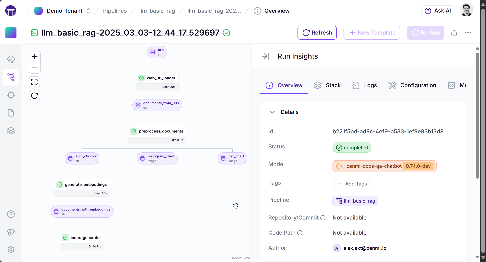
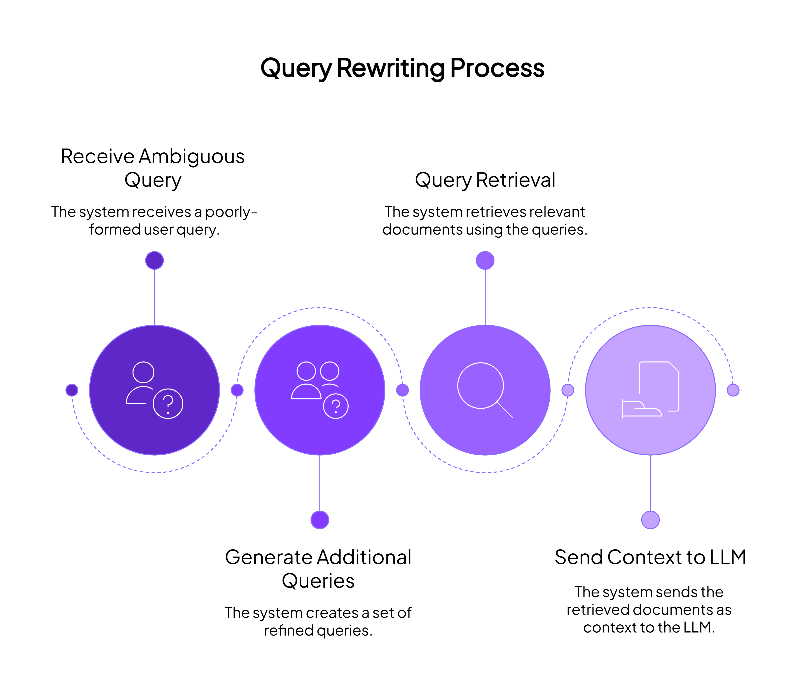

# 🦜 Query Rewriting for RAG Systems

This project demonstrates an implementation of query rewriting for Retrieval-Augmented Generation (RAG) systems, with a strong focus on proper evaluation. Query rewriting enhances RAG by transforming ambiguous or poorly-formed user queries into more effective search queries, improving retrieval quality and final answer accuracy.



## What is Query Rewriting?



Query rewriting takes the original user query and expands or reformulates it into multiple queries that can better retrieve relevant information. For example:

- **User Query**: *"How do I configure secrets in ZenML?"*
- **Rewritten Queries**: 
  - *"What are the steps for implementing secrets management in ZenML?"*
  - *"How to set up and use secrets in ZenML pipelines?"*
  - *"ZenML secrets configuration documentation"*

This technique can significantly improve retrieval quality, but without proper evaluation, it can also introduce errors or drift from the user's original intent.

## Why Evaluation Matters


While query rewriting can improve RAG system performance, it requires rigorous evaluation to ensure:

1. **Intent preservation**: Rewritten queries should maintain the original user's intent
2. **Domain accuracy**: Rewrites should use domain-specific terminology correctly
3. **Balance**: Avoiding overly specific or overly general rewrites
4. **Adaptability**: Monitoring for drift as language patterns and terminology evolve

This project implements both the query rewriting technique and comprehensive evaluation pipelines to measure its effectiveness.

## Project Components

This project includes:

1. **RAG Ingestion Pipeline**: Processes documents, generates embeddings, and creates the vector index
2. **Query Rewriting Implementation**: Expands user queries into multiple search queries
3. **Evaluation Pipeline**: Measures the effectiveness of query rewriting through multiple metrics
4. **Deployment Pipeline**: Deploys the RAG application with query rewriting to a Hugging Face Space

All pipelines are implemented using ZenML, providing tracking, caching, and visualization capabilities.

## 🏃 How to run

This project showcases production-ready pipelines so we use some cloud
infrastructure to manage the assets. You can run the pipelines locally using a
local PostgreSQL database, but we encourage you to use a cloud database for
production use cases.

### Setup your environment

Make sure you're running from a Python 3.8+ environment. Setup a virtual
environment and install the dependencies using the following command:

```shell
pip install -r requirements.txt
```

Depending on your hardware you may run into some issues when running the `pip install` command with the
`flash_attn` package. In that case running `FLASH_ATTENTION_SKIP_CUDA_BUILD=TRUE pip install flash-attn --no-build-isolation` 
could help you. Possibly you might also need to install torch separately.

In order to use the default LLM for this query, you'll need an account and an
API key from OpenAI specified as a ZenML secret:

```shell
zenml secret create llm-complete --openai_api_key=<your-openai-api-key>
export ZENML_PROJECT_SECRET_NAME=llm-complete
```

### Setting up Supabase

[Supabase](https://supabase.com/) is a cloud provider that offers a PostgreSQL
database. It's simple to use and has a free tier that should be sufficient for
this project. Once you've created a Supabase account and organization, you'll
need to create a new project.

You'll want to save the Supabase database password as a ZenML secret so that it
isn't stored in plaintext. You can do this by running the following command:

```shell
zenml secret update llm-complete -v '{"supabase_password": "YOUR_PASSWORD", "supabase_user": "YOUR_USER", "supabase_host": "YOUR_HOST", "supabase_port": "YOUR_PORT"}'
```

You can get the user, host and port for this database instance by getting the connection
string from the Supabase dashboard.

In case Supabase is not an option for you, you can use a different database as the backend.

### Running the RAG pipeline

To run the pipeline, you can use the `run.py` script. This script will allow you
to run the pipelines in the correct order. You can run the script with the
following command:

```shell
python run.py rag
```

This will run the basic RAG pipeline, which scrapes the ZenML documentation and
stores the embeddings in the Supabase database.

### Querying your RAG pipeline assets

Once the pipeline has run successfully, you can query the assets in the Supabase
database using the `--query` flag as well as passing in the model you'd like to
use for the LLM.

When you're ready to make the query, run the following command:

```shell
python run.py query --query-text "how do I use a custom materializer inside my own zenml steps? i.e. how do I set it? inside the @step decorator?" --model=gpt4o
```

Alternative options for LLMs to use include:

- `gpt4o` (default)
- `claude3` (Claude 3.7 Sonnet)
- `claudehaiku` (Claude 3.5 Haiku)

Note that Claude will require a different API key from Anthropic. See [the
`litellm` docs](https://docs.litellm.ai/docs/providers/anthropic) on how to set
this up.

### Run the evaluation pipeline

To run the evaluation pipeline, you can use the following command:

```shell
python run.py evaluation
```

You'll need to have first run the RAG pipeline to have the necessary assets in
the database to evaluate.

### Deploying the RAG pipeline


You'll need to update and add some secrets to make this work with your Hugging
Face account. To get your ZenML service account API token and store URL, you can
first create a new service account:

```bash
zenml service-account create <SERVICE_ACCOUNT_NAME>
```

For more information on this part of the process, please refer to the [ZenML
documentation](https://docs.zenml.io/how-to/project-setup-and-management/connecting-to-zenml/connect-with-a-service-account).

Once you have your service account API token and store URL (the URL of your
deployed ZenML tenant), you can update the secrets with the following command:

```bash
zenml secret update llm-complete --zenml_api_token=<YOUR_ZENML_SERVICE_ACCOUNT_API_TOKEN> --zenml_store_url=<YOUR_ZENML_STORE_URL>
```

To set the Hugging Face user space that gets used for the Gradio app deployment,
you should set an environment variable with the following command:

```bash
export ZENML_HF_USERNAME=<YOUR_HF_USERNAME>
export ZENML_HF_SPACE_NAME=<YOUR_HF_SPACE_NAME> # optional, defaults to "llm-complete-guide-rag"
```

To deploy the RAG pipeline, you can use the following command:

```shell
python run.py deploy
```

This will open a Hugging Face space in your browser where you can interact with
the RAG pipeline.

### BONUS: Connect to ZenML Pro

If you run the pipeline using ZenML Pro you'll have access to 
the managed
dashboard which will allow you to get started quickly. We offer 
a free trial so
you can try out the platform without any cost. Visit the [ZenML 
Pro
dashboard](https://cloud.zenml.io/) to get started.

You can also self-host the ZenML dashboard. Instructions are 
available in our
[documentation](https://docs.zenml.io/getting-started/
deploying-zenml).

## 📜 Project Structure

The project loosely follows [the recommended ZenML project structure](https://docs.zenml.io/how-to/setting-up-a-project-repository/best-practices):

```
.
├── LICENSE                                             # License file
├── README.md                                           # Project documentation
├── ZENML_VERSION.txt                                   # ZenML version file
├── configs/                                            # Configuration files
│   ├── dev/                                            # Development configurations
│   ├── production/                                     # Production configurations
│   └── staging/                                        # Staging configurations
├── constants.py                                        # Constants used throughout the project
├── deployment_hf.py                                    # Hugging Face deployment script
├── materializers/                                      # Custom materializers
│   ├── __init__.py
│   └── document_materializer.py                        # Document materialization logic
├── most_basic_eval.py                                  # Basic evaluation script
├── most_basic_rag_pipeline.py                          # Basic RAG pipeline script
├── pipelines/                                          # Pipeline definitions
│   ├── __init__.py
│   ├── llm_eval.py                                     # LLM evaluation pipeline
│   ├── llm_index_and_evaluate.py                       # LLM index and evaluate pipeline
│   ├── rag_deployment.py                               # RAG deployment pipeline
│   └── rag_ingestion.py                                # RAG ingestion pipeline
├── requirements.txt                                    # Project dependencies
├── run.py                                              # Main script to run the project
├── steps/                                              # Pipeline steps
│   ├── __init__.py
│   ├── eval_e2e.py                                     # End-to-end evaluation step
│   ├── eval_e2e_expansion.py                           # End-to-end evaluation with expansion step
│   ├── eval_pii.py                                     # PII evaluation step
│   ├── eval_query_rewriting.py                         # Query rewriting evaluation step
│   ├── eval_retrieval.py                               # Retrieval evaluation step
│   ├── eval_visualisation.py                           # Evaluation visualization step
│   ├── populate_index.py                               # Step to populate the index
│   ├── rag_deployment.py                               # RAG deployment step
│   ├── url_scraper.py                                  # Step to scrape URLs
│   ├── url_scraping_utils.py                           # Utilities for URL scraping
│   └── web_url_loader.py                               # Step to load web URLs
├── structures.py                                       # Data structures used in the project
├── tests/                                              # Tests
│   ├── __init__.py
│   └── test_url_scraping_utils.py                      # Tests for URL scraping utilities
└── utils/                                              # Utility functions
    ├── __init__.py
    ├── hf_utils.py                                     # Hugging Face utilities
    ├── llm_utils.py                                    # LLM utilities
    ├── openai_utils.py                                 # OpenAI utilities
    ├── test_tracing.py                                 # Test tracing utilities
    └── visualization_utils.py                          # Visualization utilities
```

## 🙏🏻 Inspiration and Credit

The RAG pipeline relies on code from [this Timescale
blog](https://www.timescale.com/blog/postgresql-as-a-vector-database-create-store-and-query-openai-embeddings-with-pgvector/)
that showcased using PostgreSQL as a vector database. We adapted it for our use
case and adapted it to work with Supabase.
